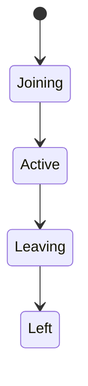

# Player Lifecycle

## Index

- [Summary](#summary)
- [Objective](#objective)
- [Scope](#scope)
- [Diagram](#diagram)
- [Responsibilities](#responsibilities)
- [Non-Responsibilities](#non-responsibilities)
- [Notes](#notes)
- [References](#references)
- [Acceptance Criteria](#acceptance-criteria)

## Summary

Player lifecycle describes how a participant enters, exists within, and leaves the server model.

## Objective

Define player behavior without binding to a specific backend architecture.

## Scope

This document covers logical lifecycle behavior only.

## Diagram

## Responsibilities

- Track player presence in the server model.
- Support join and leave behavior.
- Remain compatible with reconnect and session concepts.

## Non-Responsibilities

- Define authentication internals.
- Own transport connectivity.
- Expose engine-specific details.

## Notes

Player lifecycle should be simple enough to support both small and large deployments.

## References

- [authentication.md](authentication.md)
- [presence.md](presence.md)
- [state.md](state.md)

## Acceptance Criteria

- Lifecycle states are explicit.
- The model is easy to reason about.
- The document does not assume a specific backend.
