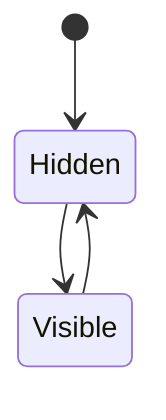

# Presence

## Index

- [Summary](#summary)
- [Objective](#objective)
- [Scope](#scope)
- [Diagram](#diagram)
- [Responsibilities](#responsibilities)
- [Non-Responsibilities](#non-responsibilities)
- [Notes](#notes)
- [References](#references)
- [Acceptance Criteria](#acceptance-criteria)

## Summary

Presence reflects whether a participant is visible to the server and associated systems.

## Objective

Specify presence as a stable server-side concept.

## Scope

This document covers presence state only.

## Diagram

## Responsibilities

- Represent participant visibility.
- Support room and channel policies.
- Remain simple and portable.

## Non-Responsibilities

- Replace session lifecycle.
- Define authentication.
- Expose transport details.

## Notes

Presence should be useful for both gameplay and technical coordination.

## References

- [player-lifecycle.md](player-lifecycle.md)
- [rooms.md](rooms.md)
- [channels.md](channels.md)

## Acceptance Criteria

- Presence states are explicit.
- The concept remains distinct from session.
- The document supports scalable behavior.
