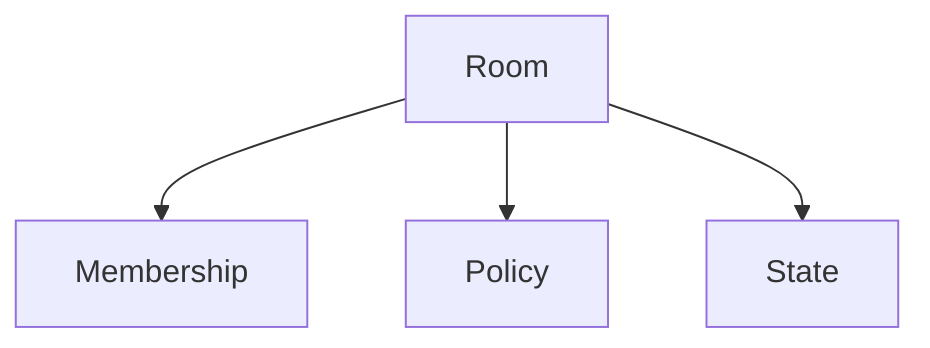

# Rooms

## Index

- [Summary](#summary)
- [Objective](#objective)
- [Scope](#scope)
- [Diagram](#diagram)
- [Responsibilities](#responsibilities)
- [Non-Responsibilities](#non-responsibilities)
- [Notes](#notes)
- [References](#references)
- [Acceptance Criteria](#acceptance-criteria)

## Summary

Server rooms manage logical grouping and state for participants and spatial rules.

## Objective

Define room behavior on the server side.

## Scope

This document covers server-side room semantics only.

## Diagram

## Responsibilities

- Maintain room membership.
- Host room-level policy and state.
- Coordinate with channels and presence.

## Non-Responsibilities

- Replace the spatial model.
- Define audio routing internals.
- Overload rooms with unrelated state.

## Notes

Server rooms should align with spatial rooms, but they are not identical concerns.

## References

- [channels.md](channels.md)
- [presence.md](presence.md)
- [../06-spatial/rooms.md](../06-spatial/rooms.md)

## Acceptance Criteria

- Room behavior is explicit.
- The scope remains server-side.
- The document avoids ambiguity with spatial rooms.
