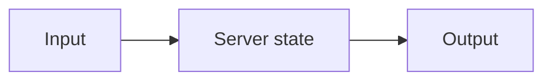

# State

## Index

- [Summary](#summary)
- [Objective](#objective)
- [Scope](#scope)
- [Diagram](#diagram)
- [Responsibilities](#responsibilities)
- [Non-Responsibilities](#non-responsibilities)
- [Notes](#notes)
- [References](#references)
- [Acceptance Criteria](#acceptance-criteria)

## Summary

State describes the server-managed information that persists beyond a single message.

## Objective

Define state ownership and stability at the server layer.

## Scope

This document covers logical state behavior only.

## Diagram

## Responsibilities

- Track server-owned information.
- Keep state consistent with permissions and rooms.
- Support persistence and scaling later.

## Non-Responsibilities

- Replace protocol state.
- Define storage internals.
- Hide ownership boundaries.

## Notes

State should be treated as a deliberate contract, not a dumping ground.

## References

- [rooms.md](rooms.md)
- [presence.md](presence.md)
- [../11-performance/targets.md](../11-performance/targets.md)

## Acceptance Criteria

- State ownership is clear.
- The document does not imply storage implementation.
- The model supports future scale decisions.
