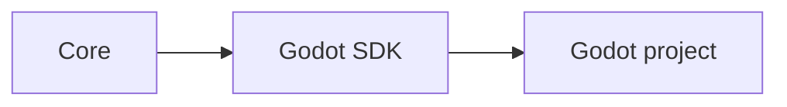

# Godot SDK

## Index

- [Summary](#summary)
- [Objective](#objective)
- [Scope](#scope)
- [Diagram](#diagram)
- [Responsibilities](#responsibilities)
- [Non-Responsibilities](#non-responsibilities)
- [Notes](#notes)
- [References](#references)
- [Acceptance Criteria](#acceptance-criteria)

## Summary

The Godot SDK adapts Resonance concepts to Godot projects.

## Objective

Define the Godot integration boundary and its expected behavior.

## Scope

This document covers the Godot adapter concept only.

## Diagram

## Responsibilities

- Integrate with Godot idioms.
- Preserve the meaning of core concepts.
- Stay separate from core and protocol definitions.

## Non-Responsibilities

- Define runtime-independent core behavior.
- Encode engine-specific assumptions into shared layers.
- Become a catch-all module for unrelated features.

## Notes

Godot integration should be simple, idiomatic, and limited in scope.

## References

- [sdk-csharp.md](sdk-csharp.md)
- [../03-core/module-boundaries.md](../03-core/module-boundaries.md)
- [../02-architecture/dependencies.md](../02-architecture/dependencies.md)

## Acceptance Criteria

- The integration boundary is explicit.
- The SDK preserves core semantics.
- The document remains concise.
