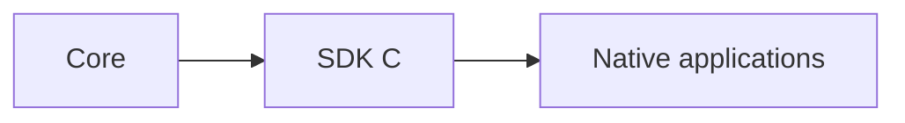

# SDK C

## Index

- [Summary](#summary)
- [Objective](#objective)
- [Scope](#scope)
- [Diagram](#diagram)
- [Responsibilities](#responsibilities)
- [Non-Responsibilities](#non-responsibilities)
- [Notes](#notes)
- [References](#references)
- [Acceptance Criteria](#acceptance-criteria)

## Summary

The C SDK provides a low-level, engine-neutral integration surface for Resonance.

## Objective

Define the role of the C SDK as the narrowest practical native integration layer.

## Scope

This document covers the C SDK concept and its integration responsibilities.

## Diagram

## Responsibilities

- Provide a stable native integration surface.
- Preserve core semantics in a low-level form.
- Serve as the base for other language or engine adapters when appropriate.

## Non-Responsibilities

- Depend on any engine.
- Redefine core behavior.
- Become a full application framework.

## Notes

The C SDK should stay small and easy to bind from other languages.

## References

- [../09-api/api-philosophy.md](../09-api/api-philosophy.md)
- [../03-core/core-overview.md](../03-core/core-overview.md)
- [sdk-csharp.md](sdk-csharp.md)

## Acceptance Criteria

- The SDK is engine-neutral.
- The surface remains minimal.
- The design is friendly to bindings and wrappers.
