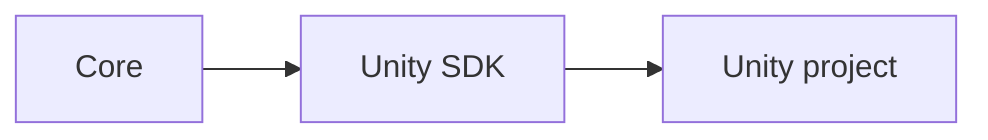

# Unity SDK

## Index

- [Summary](#summary)
- [Objective](#objective)
- [Scope](#scope)
- [Diagram](#diagram)
- [Responsibilities](#responsibilities)
- [Non-Responsibilities](#non-responsibilities)
- [Notes](#notes)
- [References](#references)
- [Acceptance Criteria](#acceptance-criteria)

## Summary

The Unity SDK adapts Resonance concepts to Unity projects.

## Objective

Define Unity-specific integration goals while keeping the core independent.

## Scope

This document covers the Unity adapter concept only.

## Diagram

## Responsibilities

- Integrate with Unity conventions.
- Translate core concepts into Unity-friendly patterns.
- Keep Unity-specific behavior out of the core.

## Non-Responsibilities

- Define core semantics.
- Depend back on Unity from shared core layers.
- Expand beyond the Unity integration boundary.

## Notes

The Unity SDK should feel native to Unity while staying faithful to Resonance concepts.

## References

- [sdk-csharp.md](sdk-csharp.md)
- [../03-core/module-boundaries.md](../03-core/module-boundaries.md)
- [../02-architecture/dependencies.md](../02-architecture/dependencies.md)

## Acceptance Criteria

- Unity integration is clearly isolated.
- The adapter preserves the core model.
- The document does not blur engine and core concerns.
