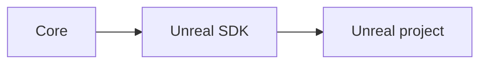

# Unreal SDK

## Index

- [Summary](#summary)
- [Objective](#objective)
- [Scope](#scope)
- [Diagram](#diagram)
- [Responsibilities](#responsibilities)
- [Non-Responsibilities](#non-responsibilities)
- [Notes](#notes)
- [References](#references)
- [Acceptance Criteria](#acceptance-criteria)

## Summary

The Unreal SDK adapts Resonance concepts to Unreal Engine projects.

## Objective

Define the Unreal integration boundary and its responsibilities.

## Scope

This document covers the Unreal adapter concept only.

## Diagram

## Responsibilities

- Fit Unreal conventions and workflows.
- Preserve core semantics in Unreal form.
- Avoid imposing Unreal assumptions on the core.

## Non-Responsibilities

- Rebuild the core model inside Unreal.
- Depend on Unreal from shared engine-agnostic layers.
- Expand the adapter into server behavior.

## Notes

Unreal integration should remain modular and maintainable over time.

## References

- [sdk-csharp.md](sdk-csharp.md)
- [../03-core/module-boundaries.md](../03-core/module-boundaries.md)
- [../02-architecture/dependencies.md](../02-architecture/dependencies.md)

## Acceptance Criteria

- The Unreal integration is clearly separated.
- The adapter remains faithful to the core.
- The scope is narrow and maintainable.
