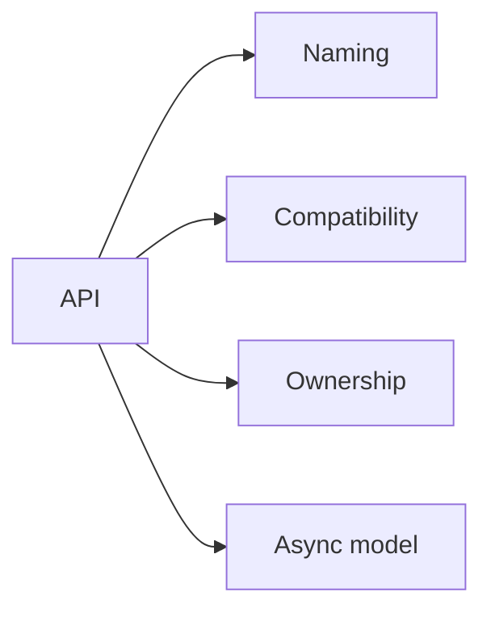

# API Philosophy

## Index

- [Summary](#summary)
- [Objective](#objective)
- [Scope](#scope)
- [Diagram](#diagram)
- [Responsibilities](#responsibilities)
- [Non-Responsibilities](#non-responsibilities)
- [Notes](#notes)
- [References](#references)
- [Acceptance Criteria](#acceptance-criteria)

## Summary

The API must be small, explicit, and stable enough to support many engines and languages.

## Objective

Define the philosophy that governs naming, compatibility, ownership, and async behavior.

## Scope

This document covers API rules, not concrete methods or types.

## Diagram

## Responsibilities

- Set naming and versioning rules.
- Define how backward compatibility should be treated.
- Clarify ownership, memory, and thread safety expectations.

## Non-Responsibilities

- Declare actual methods.
- Choose concrete data structures.
- Replace protocol or core documents.

## Notes

API philosophy should keep the surface small and understandable.

## References

- [../03-core/memory.md](../03-core/memory.md)
- [../03-core/threading.md](../03-core/threading.md)
- [../15-release/release-policy.md](../15-release/release-policy.md)

## Acceptance Criteria

- The rules are easy to apply consistently.
- The API remains portable across languages.
- The document avoids method-level design.
