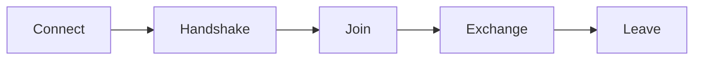

# Flows

## Index

- [Summary](#summary)
- [Objective](#objective)
- [Scope](#scope)
- [Diagram](#diagram)
- [Responsibilities](#responsibilities)
- [Non-Responsibilities](#non-responsibilities)
- [Notes](#notes)
- [References](#references)
- [Acceptance Criteria](#acceptance-criteria)

## Summary

Flows define the expected sequence of protocol interactions.

## Objective

Describe the major communication flows in a simple, implementation-neutral way.

## Scope

This document covers logical flow patterns only.

## Diagram

## Responsibilities

- Explain interaction order.
- Support protocol validation.
- Help SDKs model expected behavior.

## Non-Responsibilities

- Define byte-level sequencing.
- Dictate transport retries.
- Replace state definitions.

## Notes

Flow descriptions should be terse and predictable.

## References

- [handshake.md](handshake.md)
- [states.md](states.md)
- [versioning.md](versioning.md)

## Acceptance Criteria

- Flow order is clear.
- The document stays stable across implementations.
- The sequencing is understandable without code.
