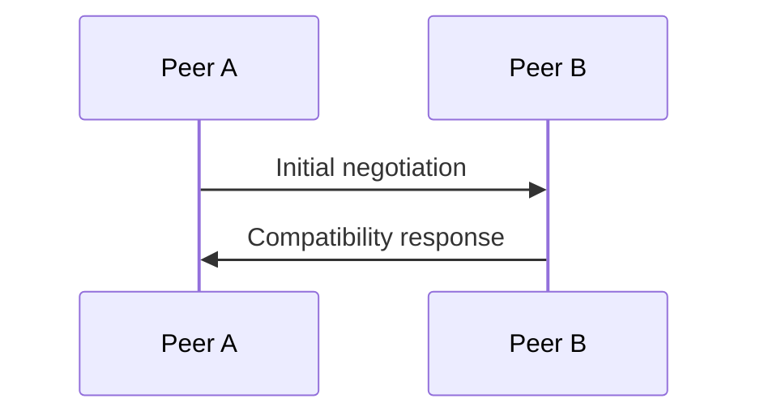

# Handshake

## Index

- [Summary](#summary)
- [Objective](#objective)
- [Scope](#scope)
- [Diagram](#diagram)
- [Responsibilities](#responsibilities)
- [Non-Responsibilities](#non-responsibilities)
- [Notes](#notes)
- [References](#references)
- [Acceptance Criteria](#acceptance-criteria)

## Summary

The handshake establishes a shared basis for subsequent protocol exchange.

## Objective

Define handshake expectations without prescribing a wire format.

## Scope

This document covers handshake semantics only.

## Diagram

## Responsibilities

- Negotiate shared capabilities.
- Confirm version compatibility.
- Establish the initial session context.

## Non-Responsibilities

- Define cryptographic bytes.
- Hide compatibility failures.
- Replace authentication policy.

## Notes

Handshake behavior must stay small and deterministic.

## References

- [protocol-overview.md](protocol-overview.md)
- [versioning.md](versioning.md)
- [compatibility.md](compatibility.md)

## Acceptance Criteria

- Negotiation goals are explicit.
- Failure behavior is understandable.
- The document remains transport-neutral.
