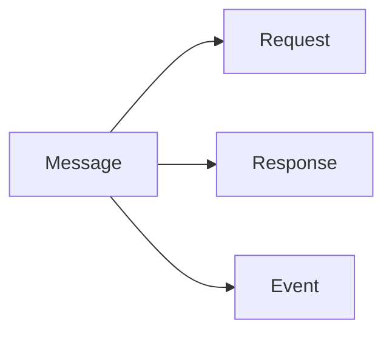

# Messages

## Index

- [Summary](#summary)
- [Objective](#objective)
- [Scope](#scope)
- [Diagram](#diagram)
- [Responsibilities](#responsibilities)
- [Non-Responsibilities](#non-responsibilities)
- [Notes](#notes)
- [References](#references)
- [Acceptance Criteria](#acceptance-criteria)

## Summary

Messages represent the conceptual units of protocol communication.

## Objective

Define message behavior without specifying payload encoding.

## Scope

This document covers message classes and expectations.

## Diagram

## Responsibilities

- Categorize protocol communication.
- Support observability and compatibility.
- Keep message meaning stable.

## Non-Responsibilities

- Define field encodings.
- Mandate transport framing.
- Blur the distinction between request and event.

## Notes

Message types should remain few enough to understand at a glance.

## References

- [protocol-overview.md](protocol-overview.md)
- [flows.md](flows.md)
- [../04-network/packet.md](../04-network/packet.md)

## Acceptance Criteria

- Message categories are explicit.
- The document remains encoding-agnostic.
- The model supports future extensions.
