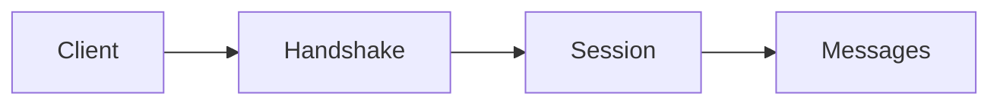

# Protocol Overview

## Index

- [Summary](#summary)
- [Objective](#objective)
- [Scope](#scope)
- [Diagram](#diagram)
- [Responsibilities](#responsibilities)
- [Non-Responsibilities](#non-responsibilities)
- [Notes](#notes)
- [References](#references)
- [Acceptance Criteria](#acceptance-criteria)

## Summary

The protocol defines the conceptual exchange model used by Resonance participants.

## Objective

Describe the protocol as a stable contract layer without defining bytes or transport specifics.

## Scope

This document covers protocol structure, not packet layout.

## Diagram

## Responsibilities

- Define the exchange model.
- Support compatibility and versioning.
- Connect high-level concepts to transport-neutral flows.

## Non-Responsibilities

- Define serialization bytes.
- Implement networking.
- Replace API philosophy or core boundaries.

## Notes

The protocol should be readable as a contract, not as an implementation guide.

## References

- [messages.md](messages.md)
- [handshake.md](handshake.md)
- [versioning.md](versioning.md)

## Acceptance Criteria

- The protocol layer is clearly separate.
- The scope stays conceptual.
- Compatibility concerns are visible.
