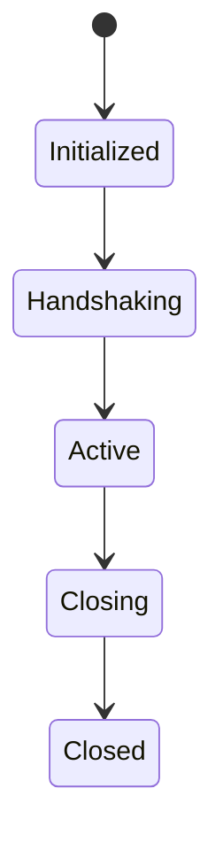

# States

## Index

- [Summary](#summary)
- [Objective](#objective)
- [Scope](#scope)
- [Diagram](#diagram)
- [Responsibilities](#responsibilities)
- [Non-Responsibilities](#non-responsibilities)
- [Notes](#notes)
- [References](#references)
- [Acceptance Criteria](#acceptance-criteria)

## Summary

Protocol states describe the valid progression of a participant in the exchange model.

## Objective

Define the major protocol states in a simple state model.

## Scope

This document covers conceptual states only.

## Diagram

## Responsibilities

- Define valid progression.
- Support validation and debugging.
- Keep participants aligned.

## Non-Responsibilities

- Specify internal timers.
- Replace connection state.
- Add states without necessity.

## Notes

The state model should remain as small as possible.

## References

- [handshake.md](handshake.md)
- [flows.md](flows.md)
- [compatibility.md](compatibility.md)

## Acceptance Criteria

- State transitions are explicit.
- The model is stable and easy to inspect.
- The document supports future implementation.
