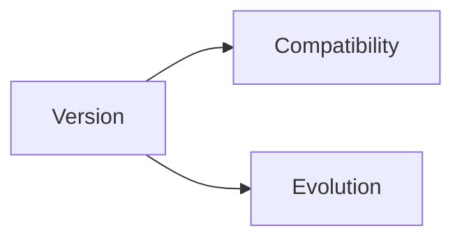

# Versioning

## Index

- [Summary](#summary)
- [Objective](#objective)
- [Scope](#scope)
- [Diagram](#diagram)
- [Responsibilities](#responsibilities)
- [Non-Responsibilities](#non-responsibilities)
- [Notes](#notes)
- [References](#references)
- [Acceptance Criteria](#acceptance-criteria)

## Summary

Protocol versioning defines how the exchange model evolves over time.

## Objective

Create a durable compatibility story for the protocol layer.

## Scope

This document covers protocol version policy only.

## Diagram

## Responsibilities

- Support forward planning.
- Preserve compatibility expectations.
- Keep evolution deliberate.

## Non-Responsibilities

- Define semantic versioning for the whole repository.
- Force unnecessary breaking changes.
- Hide version boundaries from implementers.

## Notes

Version changes should be rare and carefully documented.

## References

- [compatibility.md](compatibility.md)
- [protocol-overview.md](protocol-overview.md)
- [../15-release/release-policy.md](../15-release/release-policy.md)

## Acceptance Criteria

- Version policy is explicit.
- Compatibility implications are visible.
- The model stays simple.
