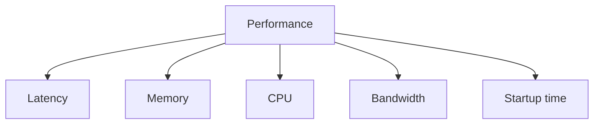

# Performance Targets

## Index

- [Summary](#summary)
- [Objective](#objective)
- [Scope](#scope)
- [Diagram](#diagram)
- [Responsibilities](#responsibilities)
- [Non-Responsibilities](#non-responsibilities)
- [Notes](#notes)
- [References](#references)
- [Acceptance Criteria](#acceptance-criteria)

## Summary

Performance targets define the budgets and quality expectations for the future implementation.

## Objective

Set concrete but realistic targets for latency, memory, CPU, scalability, bandwidth, and startup time.

## Scope

This document covers performance goals, not benchmarking code.

## Diagram

## Responsibilities

- Provide measurable targets.
- Guide implementation tradeoffs.
- Support future validation and regression detection.

## Non-Responsibilities

- Guarantee identical results on every platform.
- Replace the benchmarking strategy.
- Overstate early-phase performance readiness.

## Notes

Targets should be realistic enough to be useful and strict enough to guide engineering tradeoffs.

## References

- [../04-network/latency.md](../04-network/latency.md)
- [../05-audio/latency-targets.md](../05-audio/latency-targets.md)
- [../13-testing/testing-strategy.md](../13-testing/testing-strategy.md)

## Acceptance Criteria

- Each target is measurable.
- Budgets are consistent with the product scope.
- The document does not depend on implementation detail.
