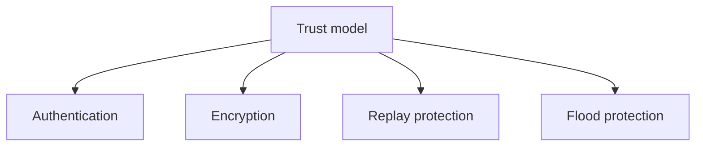

# Security Model

## Index

- [Summary](#summary)
- [Objective](#objective)
- [Scope](#scope)
- [Diagram](#diagram)
- [Responsibilities](#responsibilities)
- [Non-Responsibilities](#non-responsibilities)
- [Notes](#notes)
- [References](#references)
- [Acceptance Criteria](#acceptance-criteria)

## Summary

The security model defines the trust boundaries and protection expectations for Resonance.

## Objective

Specify the project’s security posture without choosing an implementation stack.

## Scope

This document covers threat model, encryption, authentication, replay protection, flood protection, validation, and trust boundaries.

## Diagram

## Responsibilities

- Define trust boundaries clearly.
- State required protection expectations.
- Guide future protocol and server design.

## Non-Responsibilities

- Choose cryptographic primitives.
- Replace product policy with implementation details.
- Hide security tradeoffs from documentation.

## Notes

Security should be designed into the contract, not added after implementation starts.

## References

- [../07-server/authentication.md](../07-server/authentication.md)
- [../10-protocol/handshake.md](../10-protocol/handshake.md)
- [../04-network/packet-loss.md](../04-network/packet-loss.md)

## Acceptance Criteria

- The trust model is explicit.
- Core security expectations are documented.
- The document remains implementation-neutral.
