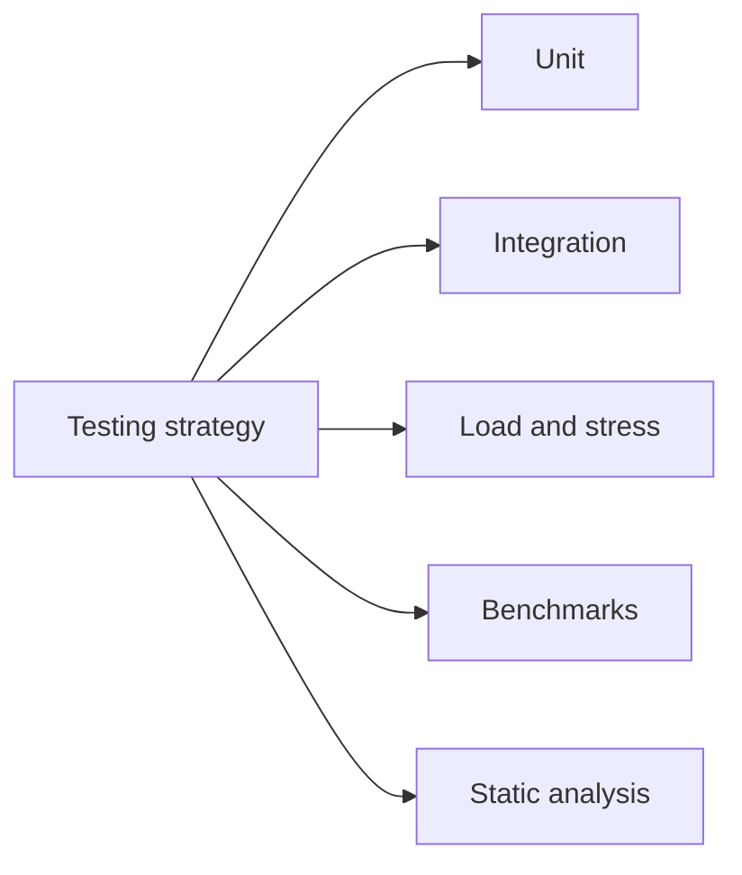

# Testing Strategy

## Index

- [Summary](#summary)
- [Objective](#objective)
- [Scope](#scope)
- [Diagram](#diagram)
- [Responsibilities](#responsibilities)
- [Non-Responsibilities](#non-responsibilities)
- [Notes](#notes)
- [References](#references)
- [Acceptance Criteria](#acceptance-criteria)

## Summary

Testing strategy defines how Resonance will be validated across layers and environments.

## Objective

Describe the full test model: unit, integration, load, stress, benchmarks, fuzzing, static analysis, and coverage.

## Scope

This document covers validation policy only.

## Diagram

## Responsibilities

- Define the validation layers.
- Set expectations for coverage and analysis.
- Support future release confidence.

## Non-Responsibilities

- Implement test code.
- Choose a specific test framework yet.
- Require unnecessary test complexity.

## Notes

Testing should verify contracts, not just implementation details.

## References

- [../11-performance/targets.md](../11-performance/targets.md)
- [../14-build/build-matrix.md](../14-build/build-matrix.md)
- [../15-release/release-policy.md](../15-release/release-policy.md)

## Acceptance Criteria

- The test layers are clearly defined.
- The strategy supports future scale.
- The document remains implementation-free.
