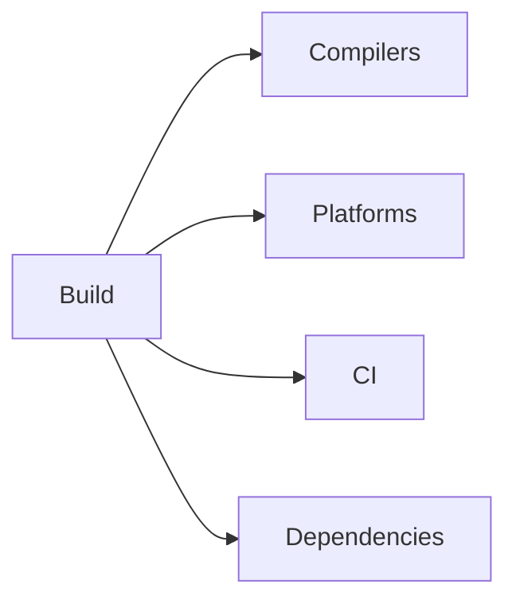

# Build Matrix

## Index

- [Summary](#summary)
- [Objective](#objective)
- [Scope](#scope)
- [Diagram](#diagram)
- [Responsibilities](#responsibilities)
- [Non-Responsibilities](#non-responsibilities)
- [Notes](#notes)
- [References](#references)
- [Acceptance Criteria](#acceptance-criteria)

## Summary

The build matrix defines the compilers, platforms, and environments supported by the project.

## Objective

Describe build expectations for future implementation and continuous integration.

## Scope

This document covers build support policy only.

## Diagram

## Responsibilities

- Define supported toolchains and platforms.
- Clarify the CI expectation.
- Support cross-platform development.

## Non-Responsibilities

- Configure build files.
- Add implementation targets.
- Choose one language ecosystem only.

## Notes

The build matrix should grow deliberately and only when the project needs it.

## References

- [../11-performance/targets.md](../11-performance/targets.md)
- [../13-testing/testing-strategy.md](../13-testing/testing-strategy.md)
- [../15-release/release-policy.md](../15-release/release-policy.md)

## Acceptance Criteria

- Supported environments are explicit.
- The document is simple to maintain.
- The build model stays cross-platform.
