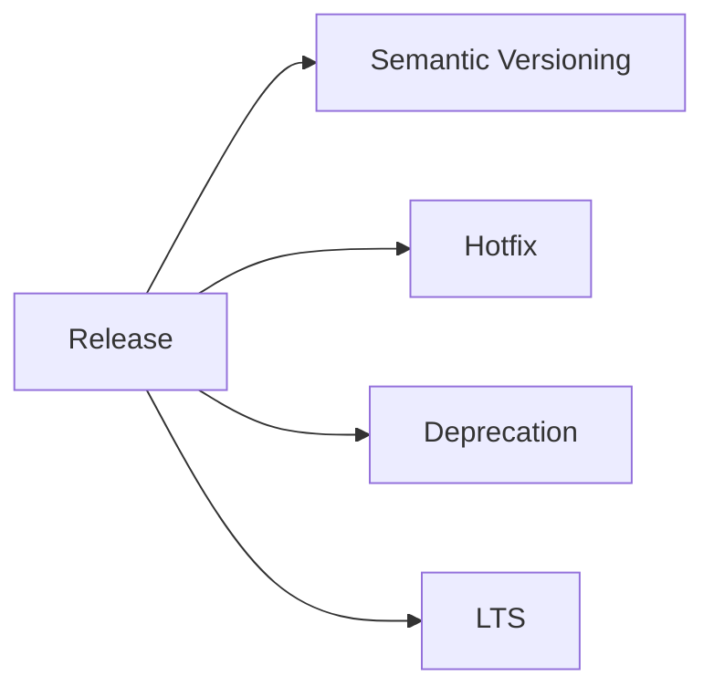

# Release Policy

## Index

- [Summary](#summary)
- [Objective](#objective)
- [Scope](#scope)
- [Diagram](#diagram)
- [Responsibilities](#responsibilities)
- [Non-Responsibilities](#non-responsibilities)
- [Notes](#notes)
- [References](#references)
- [Acceptance Criteria](#acceptance-criteria)

## Summary

Release policy defines how Resonance publishes versions, hotfixes, breaking changes, deprecations, and LTS support.

## Objective

Provide a release framework that remains simple and transparent.

## Scope

This document covers release behavior only.

## Diagram

## Responsibilities

- Define the release flow.
- Set expectations for breaking changes.
- Describe deprecation and support policy.

## Non-Responsibilities

- Implement CI release automation.
- Replace versioning policy.
- Overcomplicate support tiers.

## Notes

Release policy should remain easy to execute and easy to audit.

## References

- [../10-protocol/versioning.md](../10-protocol/versioning.md)
- [../11-performance/targets.md](../11-performance/targets.md)
- [../16-roadmap/technical-backlog.md](../16-roadmap/technical-backlog.md)

## Acceptance Criteria

- Release behavior is explicit.
- Support and deprecation are documented.
- The policy is practical for maintainers.
