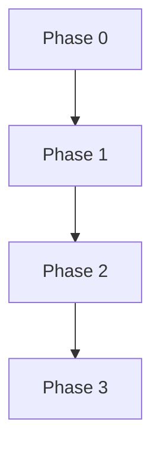

# Technical Backlog

## Index

- [Summary](#summary)
- [Objective](#objective)
- [Scope](#scope)
- [Diagram](#diagram)
- [Responsibilities](#responsibilities)
- [Non-Responsibilities](#non-responsibilities)
- [Notes](#notes)
- [References](#references)
- [Acceptance Criteria](#acceptance-criteria)

## Summary

The roadmap is a technical backlog that prioritizes the work needed before implementation can begin safely.

## Objective

Break the foundation work into ordered phases with dependencies and acceptance criteria.

## Scope

This document covers the technical roadmap only.

## Diagram

## Responsibilities

- State the order of technical work.
- Clarify prerequisites and risks.
- Help maintainers keep implementation disciplined.

## Non-Responsibilities

- Set marketing milestones.
- Replace project governance.
- Promise dates or delivery windows.

## Notes

The roadmap should remain a backlog, not a speculative feature wish list.

## References

- [../01-product/goals.md](../01-product/goals.md)
- [../02-architecture/system-overview.md](../02-architecture/system-overview.md)
- [../15-release/release-policy.md](../15-release/release-policy.md)

## Acceptance Criteria

- Each phase has clear outcomes.
- Dependencies are visible.
- The roadmap supports implementation sequencing.
