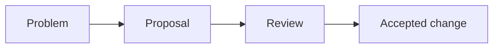

# Proposing Changes

## Index

- [Summary](#summary)
- [Objective](#objective)
- [Scope](#scope)
- [Diagram](#diagram)
- [Responsibilities](#responsibilities)
- [Non-Responsibilities](#non-responsibilities)
- [Notes](#notes)
- [References](#references)
- [Acceptance Criteria](#acceptance-criteria)

## Summary

This document explains how contributors should propose changes to the specification or architecture.

## Objective

Provide a lightweight guide for contributors who want to improve the project.

## Scope

This document covers proposal etiquette and expectations only.

## Diagram

## Responsibilities

- Tell contributors when to use RFCs or ADRs.
- Encourage small, focused proposals.
- Keep changes aligned with project goals.

## Non-Responsibilities

- Replace the RFC process itself.
- Introduce a heavy workflow for every small edit.
- Impose implementation details.

## Notes

The smaller the change, the lighter the process should be.

## References

- [rfc-process.md](rfc-process.md)
- [rfc-template.md](rfc-template.md)
- [../../decisions/README.md](../../decisions/README.md)

## Acceptance Criteria

- Contributors can understand when to propose a change.
- The guidance is short and practical.
- The document reinforces KISS.
