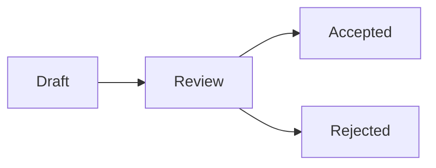

# RFC Template

## Index

- [Summary](#summary)
- [Objective](#objective)
- [Scope](#scope)
- [Diagram](#diagram)
- [Responsibilities](#responsibilities)
- [Non-Responsibilities](#non-responsibilities)
- [Notes](#notes)
- [References](#references)
- [Acceptance Criteria](#acceptance-criteria)

## Summary

RFCs are the formal mechanism for proposing and reviewing significant changes.

## Objective

Provide a reusable template for proposals that affect the specification or architecture.

## Scope

This document defines the RFC shape, not the content of a specific proposal.

## Diagram

## Responsibilities

- Capture the problem, options, decision, and consequences.
- Support review before implementation.
- Provide a stable proposal format.

## Non-Responsibilities

- Replace ADRs for small architectural choices.
- Dictate implementation details.
- Add unnecessary process overhead.

## Notes

RFCs should be used when the change is important enough to warrant broader review.

## References

- [rfc-process.md](rfc-process.md)
- [states.md](states.md)
- [numbering.md](numbering.md)

## Acceptance Criteria

- The template is easy to use.
- The template is complete enough to guide proposals.
- The template remains lightweight.
