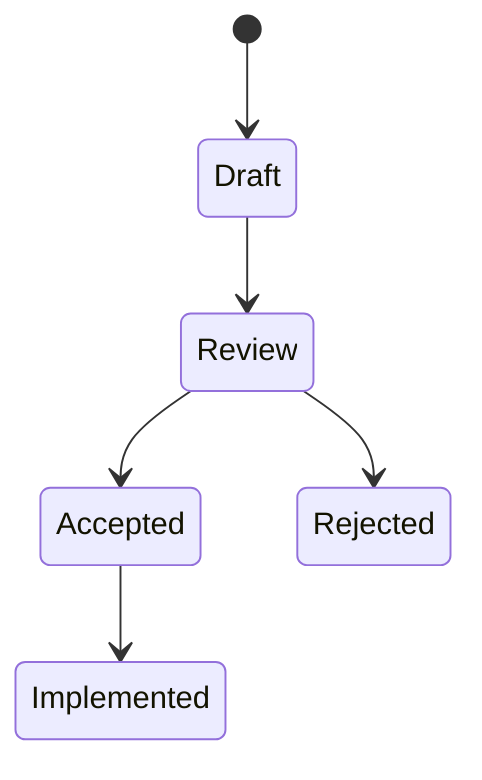

# RFC States

## Index

- [Summary](#summary)
- [Objective](#objective)
- [Scope](#scope)
- [Diagram](#diagram)
- [Responsibilities](#responsibilities)
- [Non-Responsibilities](#non-responsibilities)
- [Notes](#notes)
- [References](#references)
- [Acceptance Criteria](#acceptance-criteria)

## Summary

RFC states describe the lifecycle of a proposal from idea to closure.

## Objective

Define the allowed status transitions for RFCs.

## Scope

This document covers RFC state semantics only.

## Diagram

## Responsibilities

- Make RFC status visible.
- Support process discipline.
- Distinguish proposal maturity levels.

## Non-Responsibilities

- Define ADR states.
- Replace implementation tracking.
- Add unnecessary lifecycle steps.

## Notes

Status should be kept intentionally small.

## References

- [rfc-process.md](rfc-process.md)
- [rfc-template.md](rfc-template.md)
- [numbering.md](numbering.md)

## Acceptance Criteria

- Statuses are easy to understand.
- Transitions are clear.
- The model is minimal.
