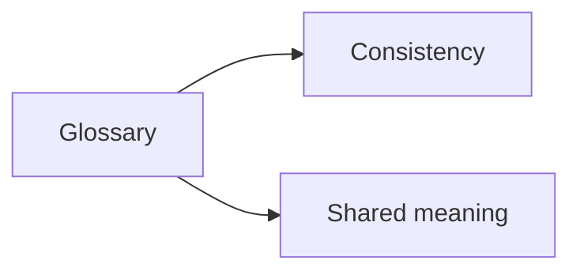

# Glossary

## Index

- [Summary](#summary)
- [Objective](#objective)
- [Scope](#scope)
- [Diagram](#diagram)
- [Responsibilities](#responsibilities)
- [Non-Responsibilities](#non-responsibilities)
- [Notes](#notes)
- [References](#references)
- [Acceptance Criteria](#acceptance-criteria)

## Summary

The glossary defines the shared vocabulary used throughout Resonance.

## Objective

Keep technical language stable and consistent across specifications.

## Scope

This document covers terms used in the project specifications and architecture.

## Diagram

## Responsibilities

- Define common terms.
- Reduce ambiguity.
- Support interoperable documentation.

## Non-Responsibilities

- Replace detailed specifications.
- Add synonyms that create confusion.
- Become a full domain encyclopedia.

## Notes

The glossary should stay pragmatic and focused on terms the project actually uses.

## References

- [rooms.md](../06-spatial/rooms.md)
- [channels.md](../07-server/channels.md)
- [protocol-overview.md](../10-protocol/protocol-overview.md)

## Acceptance Criteria

- Shared terms are defined consistently.
- Definitions remain stable.
- The glossary stays small enough to maintain.
